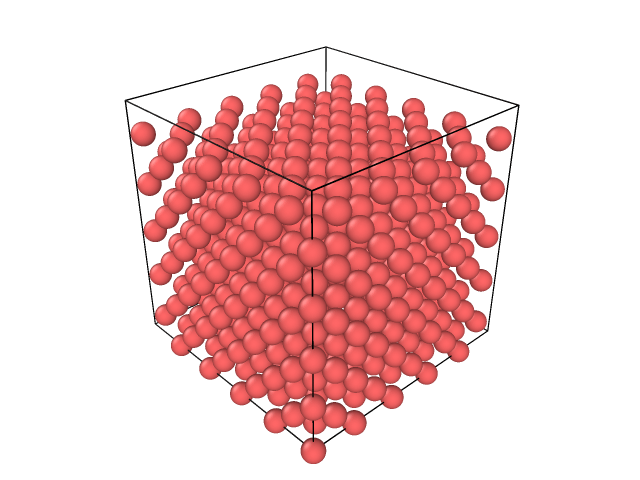

## Hi there 👋, I am Vivek Naik

<!--
**vivekadishankara/vivekadishankara** is a ✨ _special_ ✨ repository because its `README.md` (this file) appears on your GitHub profile.

Here are some ideas to get you started:

- 🔭 I’m currently working on ...
- 🌱 I’m currently learning ...
- 👯 I’m looking to collaborate on ...
- 🤔 I’m looking for help with ...
- 💬 Ask me about ...
- 📫 How to reach me: ...
- 😄 Pronouns: ...
- ⚡ Fun fact: ...
-->

I am a python developer in firmware automation testing, trying to pivot my career in Rust development.
Have been learning Rust for a year now. The most awesome thing I did in 2025 was this:

- 🔭 I’m currently working on [A molecular dynamics program](https://github.com/vivekadishankara/pis) in Rust which generated the gif above
- 🌱 I’m currently learning Rust
- 👯 I’m looking to collaborate on [bevy game engine](https://github.com/bevyengine/bevy)
- 📫 How to reach me: Please contact me vivek.naik@zohomail.in